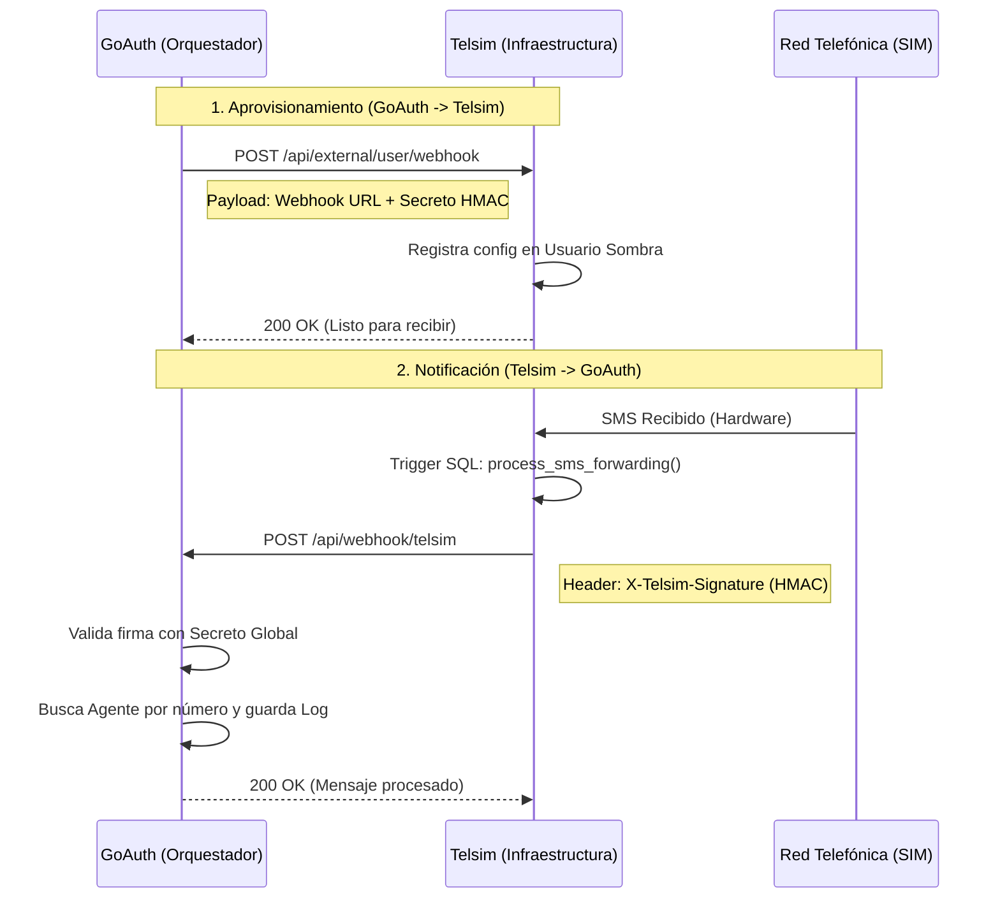

# Arquitectura de Integración: Telsim ↔ GoAuth

Este documento detalla el flujo de comunicación entre el proveedor de infraestructura (**Telsim**) y el consumidor de servicios (**GoAuth**).

## Diagrama de Secuencia

## Comparativa de Roles

| Característica | Telsim (Mundo 2) | GoAuth (Mundo 1) |
| :--- | :--- | :--- |
| **Rol Principal** | Proveedor de Infraestructura (SaaS) | Consumidor/Cerebro (AI Agents) |
| **Responsable de** | SIMs, SMS, Database Triggers | Lógica de Negocio, Dashboard, UI |
| **Seguridad Saliente** | Firma HMAC (X-Telsim-Signature) | Bearer JWT (TELSIM_API_TOKEN) |
| **Seguridad Entrante** | Bearer JWT | Firma HMAC (X-Telsim-Signature) |

## Configuración de Seguridad
Para esta integración se utiliza un **Secreto Global** configurado en ambas plataformas:

- **En GoAuth (.env):** `TELSIM_WEBHOOK_SECRET`
- **En Telsim (Shadow User):** `api_secret_key`

> [!TIP]
> Al usar firmas HMAC, GoAuth puede estar 100% seguro de que los mensajes que recibe en su webhook son auténticos y provienen de Telsim, sin necesidad de consultar la API constantemente (Pull) sino recibiendo los datos en tiempo real (Push).
